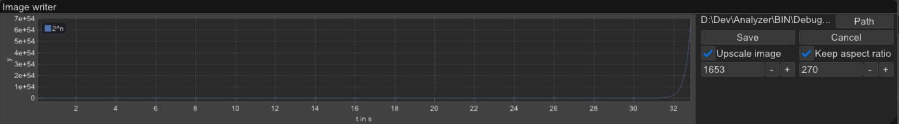

# Analyzer
This is an application that displays plots sent from an Arduino device. The application parses formatted strings received from the device and displays the data as plots, with the x-axis being the elapsed time since the connection started.

The string should be in the format of `plot_name:y_label:graph_name:value\n`. However, all of these values except for `value` can be defaulted, thus there's no need to provide them if you don't want to.

# Application

You can customize the plots or legends by right clicking on them.

## Settings
### Cleanup Graphs
If this is enabled the app will try to clean the internally used arrays to only leave necessary entries to save memory and get a better performance. However eventhough the graphs should not be altered in this process it might happen, so consider disabling this feature if the graphs look odd.
### Cleanup only same
Only removed entries if their `y` values are the same (e.g. `f(x)=7`) can be reduced to two entries marking the first and last coordinate. This settings only works if `Cleanup Graphs` is also enabled.
### Debug info
Shows the number of coordinates every graphs has internally right next to it's name in the legend. It's called `Debug info` because activating it will cause the graphs to rapidly change their color however I wanted to leave it in because it might be a useful information for some people. 

# Example Usage
Here is an example of how to use this application:
1. Connect your Arduino board to your computer.
2. Open a serial communication program (e.g. Arduino IDE)
3. Upload the following code to your Arduino board:
```c++
void setup() 
{
  Serial.begin(9600);
}

static uint32_t i = 0;
void loop() 
{
  Serial.printf("##exp:y:2^n:%.12f\n", pow(2, i)/1000000000000.0);
  Serial.printf("##nlog:y:nlog(n):%.12f\n", i*log(i));
  Serial.printf("##log:y:log(n):%.12f\n", log(i)/100000.0);
  Serial.printf("##log:y:-log(n):%.12f\n", -log(i)/100000.0);
  ++i;
  delay(1000);
}
```
4. Run the Analyzer on your computer.
5. Choose the correct serial port and baud rate in the application settings.
6. Click on `Connect` and wait for the plots to appear, this might take some time.

# String Format
The following format is expected for the input string:

```
plot_name:y_label:graph_name:value\n
```

- `plot_name`: Will be centered above the plot. You can use "##" in front of the name to not show it as a title (e.g. `##log`). Defaults to `##default`.
- `y_label`: What's shown on the y-axis. Defaults to `y`.
- `graph_name`: The name of the graph, used to properly assign the values and is shown in the legend. Defaults to `f(x)`.
- `value`: The y-axis value. The x-axis will always show the elapsed time in seconds. This value cannot be defaulted.
- `\n`: The newline is important because it marks the end of an entry. Thus, every entry has to have one.

# Saving Plots
You can save the plots as images by clicking the "Save Plot" button in the application window. You can choose to save all plots in one image or save each plot separately in its own image. When saving, you can also choose to upscale or downscale the images.


# Supported devices
I've only been able to test it with an esp32 and an arduino uno, however other devices should work fine aswell, since all the application does is to parse the provided string, thus as long as the string is properly formatted it shouldn't be an issue to use something else.
### Troubleshooting
If your device doesn`t show up in the port selection list make sure you have the proper drivers installed.

# Platforms
Supported platform:
- [x] Windows
- [ ] Linux

Currently, only available for Windows. However, I am considering adding Linux support in the future.

# Build
## Using premake
This is the prefered and only way if you want to have a visual studio project. The project uses premake as it's build system with the premake5 binaries already provided. I've tested building it with visual studio, clang and gcc, however other compilers might work aswell, just give it a try.

For additional information use:
```
vendor\premake5 --help
```

## Clone

```
git clone https://github.com/pyvyx/Analyzer.git
```
```
cd Analyzer
```

## Visual Studio

```
vendor\premake5.exe vs2022
```
This should generate a .sln file

## Make

```
vendor\premake5.exe gmake [cc]
```

GCC should already be the default compiler, however you can explicitly specify it if you'd like.  
GCC:   --cc=gcc  
Clang: --cc=clang

### Build

```
make [-j] config=<configuration>
```
Configurations:
 - debug_x86
 - debug_x64 (default, the same as just using `make`)
 - release_x86
 - release_x64

`-j` flag tells make to compile multithreaded

```
make help
```
for additional information

## Using build script
If your just interested in building the project (without project files) you can use the provided script in `scripts\`. This script has to be executed from the main directory.
```
scripts\build.py [cc]
```
Replace `[cc]` with either `gcc` or `clang`